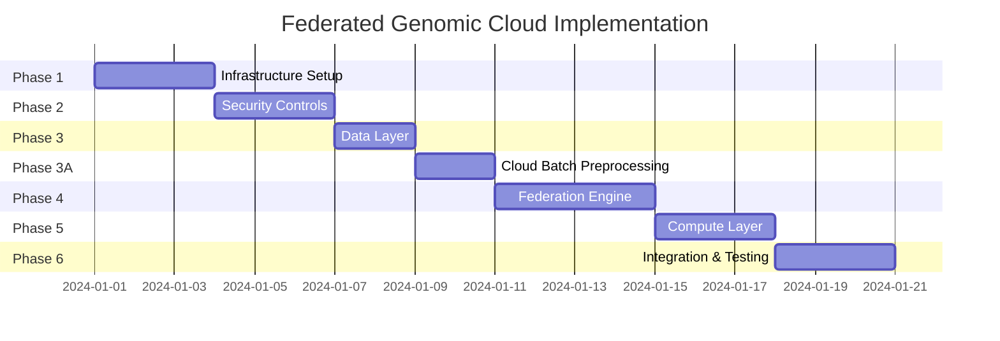

# Sovereign Federated Genomic Cloud - Implementation Documentation

## Overview

This directory contains the detailed implementation documentation for building a **Sovereign, Privacy-Preserving Federated Learning Platform** on Google Cloud. The platform enables cross-border genomic research while maintaining strict data sovereignty compliance (GDPR, HIPAA, PDPA).

## Core Principles

| Principle | Implementation | GCP Service |
|-----------|----------------|-------------|
| **Sovereignty by Design** | Data never leaves the jurisdiction | VPC Service Controls |
| **Zero-Trust Compute** | Memory encryption during processing | Confidential VMs (AMD SEV) |
| **Moving Math, Not Data** | Models travel to data, not vice versa | TensorFlow Federated + Pub/Sub |

## Architecture Summary

```
┌─────────────────────────────────────────────────────────────────────────────┐
│                           FEDERATION HUB (Asia)                              │
│                         Project: fed-hub                                     │
│  ┌─────────────────────────────────────────────────────────────────────┐   │
│  │  Cloud Run (Orchestrator)  ←→  Pub/Sub (tff-broadcast, tff-upload)  │   │
│  └─────────────────────────────────────────────────────────────────────┘   │
└─────────────────────────────────────────────────────────────────────────────┘
                    ↑ Model Weights Only ↑
        ┌───────────┴───────────────────────┴───────────┐
        ↓                                               ↓
┌───────────────────────────────┐     ┌───────────────────────────────┐
│   SOVEREIGN NODE A (US)       │     │   SOVEREIGN NODE B (EU)       │
│   Project: fed-node-us        │     │   Project: fed-node-eu        │
│   Region: us-central1         │     │   Region: europe-west2        │
│   Data Law: HIPAA             │     │   Data Law: GDPR              │
│ ┌───────────────────────────┐ │     │ ┌───────────────────────────┐ │
│ │  VPC Service Controls     │ │     │ │  VPC Service Controls     │ │
│ │  (Block All Data Egress)  │ │     │ │  (Block All Data Egress)  │ │
│ ├───────────────────────────┤ │     │ ├───────────────────────────┤ │
│ │  Confidential VM (TFF)    │ │     │ │  Confidential VM (TFF)    │ │
│ │  Local Training Worker    │ │     │ │  Local Training Worker    │ │
│ ├───────────────────────────┤ │     │ ├───────────────────────────┤ │
│ │  BigQuery Dataset         │ │     │ │  BigQuery Dataset         │ │
│ │  (CMEK Encrypted)         │ │     │ │  (CMEK Encrypted)         │ │
│ └───────────────────────────┘ │     │ └───────────────────────────┘ │
└───────────────────────────────┘     └───────────────────────────────┘
```

## Document Index

| Phase | Document | Description |
|-------|----------|-------------|
| **0** | [00_overview.md](./00_overview.md) | This document - project overview |
| **1** | [01_infrastructure_setup.md](./01_infrastructure_setup.md) | GCP project creation, Terraform deployment |
| **2** | [02_security_controls.md](./02_security_controls.md) | VPC-SC, Org Policies, IAM configuration |
| **3** | [03_data_layer.md](./03_data_layer.md) | BigQuery setup, synthetic data generation |
| **3A** | [03a_preprocessing_pipeline.md](./03a_preprocessing_pipeline.md) | Cloud Batch genomic preprocessing (scalability demo) |
| **3B** | [03b_deepvariant_pipeline.md](./03b_deepvariant_pipeline.md) | **DeepVariant** variant calling (GPU, production) |
| **4** | [04_federation_engine.md](./04_federation_engine.md) | TensorFlow Federated, Pub/Sub messaging |
| **5** | [05_compute_layer.md](./05_compute_layer.md) | Confidential VMs, Cloud Run Jobs |
| **6** | [06_deployment_runbook.md](./06_deployment_runbook.md) | Step-by-step deployment commands |
| **7** | [07_verification_testing.md](./07_verification_testing.md) | Testing procedures, compliance validation |
| **8** | [08_looker_dashboards.md](./08_looker_dashboards.md) | Looker Studio dashboards for analytics |

## Implementation Phases



## Prerequisites

- Google Cloud Organization with Org Policy permissions
- Billing account linked to projects
- Terraform >= 1.0.0
- gcloud CLI authenticated with sufficient permissions
- Python 3.9+ with TensorFlow Federated

## Quick Start

```bash
# 1. Clone and navigate
cd Federated_Genomic

# 2. Set up projects (manual or use script)
./export_apply_org_policies.sh --create-new fed-hub --billing BILLING_ID

# 3. Deploy infrastructure with Terraform
cd terraform
terraform init
terraform plan -var="project_id=fed-node-us"
terraform apply

# 4. Follow phase-specific guides in this directory
```

## Key GCP Services Used

| Service | Purpose |
|---------|---------|
| **Cloud Projects** | Isolation boundary per sovereign node |
| **VPC Service Controls** | Data exfiltration prevention |
| **Organization Policies** | Enforce resource locations |
| **BigQuery** | Sovereign data storage (CMEK encrypted) |
| **Cloud KMS** | Customer-managed encryption keys |
| **Pub/Sub** | Async messaging for federated learning |
| **Cloud Batch** | Scalable genomic preprocessing (Confidential VMs) |
| **Cloud Run** | Serverless compute for TFF workers |
| **Confidential VMs** | Hardware-encrypted memory (AMD SEV) |
| **Cloud Monitoring** | Audit logging & compliance reporting |
