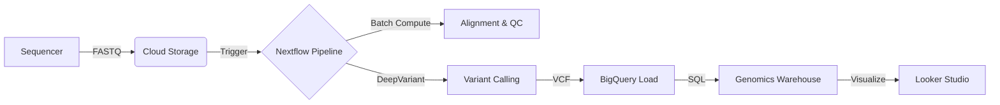

# Multiomics Reference Architecture
> **A Cloud-Native Platform for Scalable Genomic Analysis on Google Cloud**

[](https://cloud.google.com)
[](https://www.nextflow.io)
[](https://cloud.google.com/bigquery)

---

## 🚀 Mission: From Files to Insights
Traditional genomic analysis is bottled-necked by file-based workflows (VCFs, BAMs) and fixed-capacity HPC clusters. This project provides a reference architecture to modernize the stack, transforming genomic data into a queryable, scalable asset.

**Key Capabilities:**
*   **Elastic Compute:** Scale variant calling from 10 to 10,000 samples automatically using **Cloud Batch**.
*   **Structured Data:** Ingest variants into **BigQuery** for population-scale SQL analytics.
*   **AI-Ready:** Integrated **DeepVariant** pipelines for state-of-the-art accuracy.
*   **Self-Service:** Interactive **Looker Studio** dashboards for clinicians and researchers.

---

## 🏗️ Architecture

The platform follows a modern **Ingest → Transform → Analyze** pattern:



| Layer | Component | Technology |
|-------|-----------|------------|
| **1. Compute** | Orchestration & Execution | Nextflow + Google Cloud Batch |
| **2. Data** | Storage & Warehouse | Cloud Storage + BigQuery |
| **3. Analytics** | Visualization | Looker Studio |

---

## 📂 Project Structure

```bash
multiomnic-ref/
├── documentations/           # High-level Vision & Architecture docs
│   ├── 1.vision.md
│   └── 2.architecture.md
├── implementation/           # The Core Codebase
│   ├── terraform/            # Infrastructure as Code (IaC)
│   ├── pipelines/            # Nextflow workflows (main.nf)
│   ├── scripts/              # Helper scripts & Batch job definitions
│   └── docs/                 # Detailed Technical Guides
└── multiomnic-env/           # Python Virtual Environment (Local dev)
```

---

## ⚡ Quick Start

### Prerequisites
*   Google Cloud Project with Billing enabled
*   `gcloud` CLI installed
*   Terraform >= 1.0

### 1. Deploy Infrastructure
```bash
cd implementation/terraform
# Initialize and apply Terraform to create Buckets, Batch queues, and BigQuery datasets
terraform init
terraform apply -var="project_id=YOUR_PROJECT_ID"
```

### 2. Run the Pipeline (Demo Mode)
Run the pipeline on a public 1000 Genomes sample (HG00119) without needing to upload your own data.

```bash
cd ../pipelines
nextflow run main.nf \
  -profile gcp \
  --project_id YOUR_PROJECT_ID \
  --sample_id HG00119 \
  --run_variant_calling true
```

### 3. Query the Data
Once the pipeline finishes, query the results directly in BigQuery:

```sql
SELECT chromosome, COUNT(*) as variant_count 
FROM `YOUR_PROJECT_ID.genomics_warehouse.deepvariant_variants` 
GROUP BY chromosome 
ORDER BY variant_count DESC
```

---

## 📚 Documentation

Detailed guides for each component can be found in `implementation/docs/`:

*   **[Deployment Guide](implementation/docs/QUICKSTART.md):** Step-by-step setup instructions.
*   **[Nextflow Guide](implementation/docs/NEXTFLOW_GUIDE.md):** How to run, debug, and customize workflows.
*   **[Looker Studio Guide](implementation/docs/LOOKER_STUDIO_GUIDE.md):** Creating the analytics dashboard.
*   **[Validation Guide](implementation/docs/VALIDATION_GUIDE.md):** Verifying the results.

---

## 🤝 Contribution
This is a reference implementation. We welcome pull requests to improve pipelines, add new modules (e.g., RNA-seq), or optimize costs.

## 📄 License
[Apache 2.0](LICENSE) - Built with ❤️ on Google Cloud.
